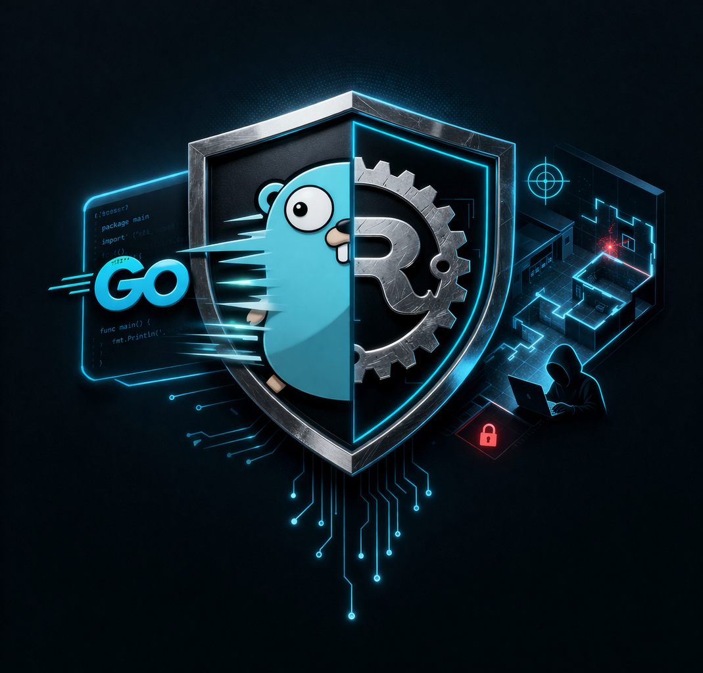

# homework
# 攻防一体

## 🚀 团队简介
攻防一体是一个专注于 **网络安全与系统开发** 的技术团队，主要研究方向包括：

- 内网渗透与安全攻防 🔐
- 高性能系统开发 ⚙️
- 自动化安全工具 🤖

团队致力于通过工程化能力与安全技术结合，构建高效、智能的安全解决方案。

---

## 🧩 技术方向

### 🔐 安全方向
- 内网渗透（Lateral Movement / Privilege Escalation）
- 漏洞利用与安全测试
- 安全工具开发

### ⚙️ 系统开发
- Go（高并发工具开发）
- Rust（高安全系统开发）

### 🤖 AI & Agent
- 自动化渗透 Agent
- 安全扫描智能体
- LLM + 安全分析

---

## 🛠 技术栈

- 🐍 Python（自动化、安全脚本）
- ☕ Java（企业级系统 / 安全平台）
- 🐹 Go（高性能工具）
- 🦀 Rust（安全底层开发）
- 🤖 AI Agent（智能化工具）

---

## 🎨 Logo设计理念

本Logo采用“盾牌 + 网络结构 + 编程语言元素”设计：

- 🛡️ 盾牌：代表安全防护
- 🌐 网络拓扑：象征内网渗透环境
- ⚙️ Rust齿轮 + Go元素：体现系统能力
- 💻 终端代码：代表攻防技术

整体风格突出：
👉 安全性 + 工程能力 + 技术深度

---

## 🎯 团队愿景

- 打造自动化安全工具体系
- 探索 AI + 网络安全结合
- 成为具备攻防能力的工程团队
- 掌握企业级前端开发流程
- 成为具备工程能力的前端工程师
