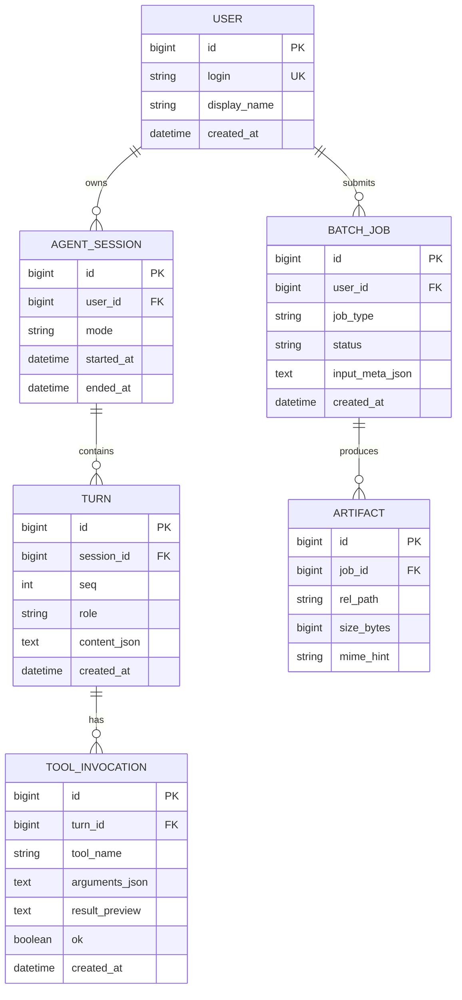

# LSJGP 数据库设计说明书

**项目名称**：基于 MCP 与 DeepSeek 的智能体工作台（Agent Web）  
**团队**：LSJGP（广东工业大学计算机学院 · 软件工程）  
**文档版本**：V1.0  
**编制日期**：2026-05-10  

---

## 1 引言

### 1.1 编写目的

描述本系统的**数据存储形态**、**逻辑数据模型**及与程序结构的映射关系；对当前以文件系统为主的实现给出规范化说明，并对二期引入关系型数据库给出 **ER 图与关系模式**，满足课程对数据库设计文档的要求。

### 1.2 定义与缩略语

| 缩写 | 含义 |
|------|------|
| **ER** | Entity-Relationship，实体联系 |
| **PK** | Primary Key |
| **FK** | Foreign Key |
| **ORM** | Object-Relational Mapping |
| **JSON** | JavaScript Object Notation，用于 LLM 对齐片段键 |

---

## 2 数据存储现状分析

### 2.1 当前实现（V0）

| 存储类型 | 位置 / 机制 | 说明 |
|----------|-------------|------|
| 工作区文件 | `WORKSPACE_ROOT` 目录树 | 抓取结果、`epub_out/`、`image_out/`、`wallpaper/`、`catalog/` 等 |
| 会话状态 | WebSocket 进程内存 | 对话历史、当前轮次，**不落库** |
| 用户偏好 | 浏览器 LocalStorage | DeepSeek Key、Base URL、模型、后端 Origin 等 |
| 关系型数据库 | **无** | 未引入 MySQL / PostgreSQL / SQLite 业务库 |

### 2.2 设计结论

- 文档中的 **ER 图与关系模式** 以 **「二期可扩展模型」** 为主，与课程「关系数据模型」要求对齐。  
- **对象—关系映射** 一节同时说明：**当前 Python 类 ↔ 文件/内存**；**未来 SQLAlchemy 模型 ↔ 表**。

---

## 3 概念模型（ER 图）

以下实体为规划中的**多用户 / 可审计**扩展；单用户本机部署时可退化为单用户记录或省略部分表。

**实体说明**：

- **USER**：系统使用者（二期）。  
- **AGENT_SESSION**：一次 WS 连接对应的会话元数据。  
- **TURN**：每轮用户输入或助手消息（含 tool_calls 可序列化入 `content_json`）。  
- **TOOL_INVOCATION**：单次 MCP 工具调用审计。  
- **BATCH_JOB**：EPUB / 图片等 HTTP 长任务。  
- **ARTIFACT**：任务产出在工作区中的相对路径与大小。

---

## 4 逻辑结构设计（关系数据模型）

### 4.1 关系模式（3NF 草案）

**USER**（`user_id`, `login`, `display_name`, `created_at`）  
- PK：`user_id`  
- UK：`login`

**AGENT_SESSION**（`session_id`, `user_id`, `mode`, `started_at`, `ended_at`）  
- PK：`session_id`  
- FK：`user_id` → USER.`user_id`

**TURN**（`turn_id`, `session_id`, `seq`, `role`, `content_json`, `created_at`）  
- PK：`turn_id`  
- FK：`session_id` → AGENT_SESSION.`session_id`  
- 约束：`seq` 在会话内递增

**TOOL_INVOCATION**（`invocation_id`, `turn_id`, `tool_name`, `arguments_json`, `result_preview`, `ok`, `created_at`）  
- PK：`invocation_id`  
- FK：`turn_id` → TURN.`turn_id`

**BATCH_JOB**（`job_id`, `user_id`, `job_type`, `status`, `input_meta_json`, `created_at`）  
- PK：`job_id`  
- FK：`user_id` → USER.`user_id`  
- `job_type` ∈ { `epub_localize`, `image_comic_translate`, … }

**ARTIFACT**（`artifact_id`, `job_id`, `rel_path`, `size_bytes`, `mime_hint`）  
- PK：`artifact_id`  
- FK：`job_id` → BATCH_JOB.`job_id`  
- `rel_path` 为相对 `WORKSPACE_ROOT` 的路径，与现网 `resolve_safe` 一致

### 4.2 与文件系统的关系

- **ARTIFACT.rel_path** 与现有 **`/api/catalog`** 列表一致；删除 DB 记录不自动删文件时，需异步 GC 策略（规划）。  
- 当前无 `BATCH_JOB` 表时，**文件即事实来源（source of truth）**。

---

## 5 对象—关系映射（ORM）

### 5.1 当前实现（无 RDBMS）

| 程序侧概念 | 实际载体 | 说明 |
|--------------|----------|------|
| `Path` / 文件字节 | 磁盘文件 | `epub_cn`、`image_comic` 写 `epub_out/`、`image_out/` |
| `history: List[dict]` | WS 进程内存 | `engine.trim_tail` 裁剪 |
| `AppPrefs`（前端） | LocalStorage 键值 | `prefs.js` 中 `agent.*` 前缀 |

### 5.2 规划 ORM（SQLAlchemy 风格伪代码）

| Python 类（规划） | 数据库表 | 关键字段映射 |
|---------------------|----------|----------------|
| `models.User` | `USER` | `id`, `login`, `display_name` |
| `models.AgentSession` | `AGENT_SESSION` | `id`, `user_id`, `mode` |
| `models.Turn` | `TURN` | `id`, `session_id`, `seq`, `role`, `content_json` |
| `models.ToolInvocation` | `TOOL_INVOCATION` | `id`, `turn_id`, `tool_name`, `arguments_json` |
| `models.BatchJob` | `BATCH_JOB` | `id`, `user_id`, `job_type`, `status` |
| `models.Artifact` | `ARTIFACT` | `id`, `job_id`, `rel_path`, `size_bytes` |

**映射约束**：`Artifact.rel_path` 写入前经与 `workspace_fs.resolve_safe` 相同规则的校验，防止 DB 中记录非法路径。

---

## 6 数据安全与备份

- **备份**：定期打包 `WORKSPACE_ROOT` 目录。  
- **敏感字段**：`USER` 表不存明文 API Key；若存令牌应加密或使用系统密钥管理。  
- **迁移路径**：首期文件 → 二期可增加 `artifact_hash` 去重与完整性校验。

---

## 7 设计追溯

| 业务 | 当前数据 | 二期表 |
|------|----------|--------|
| EPUB 产出 | `epub_out/*.epub` 文件 | `BATCH_JOB` + `ARTIFACT` |
| 图片产出 | `image_out/*.png` | 同上 |
| 对话历史 | 内存 | `AGENT_SESSION` + `TURN` |

---

**编制**：LSJGP  
**审定**：（占位）
