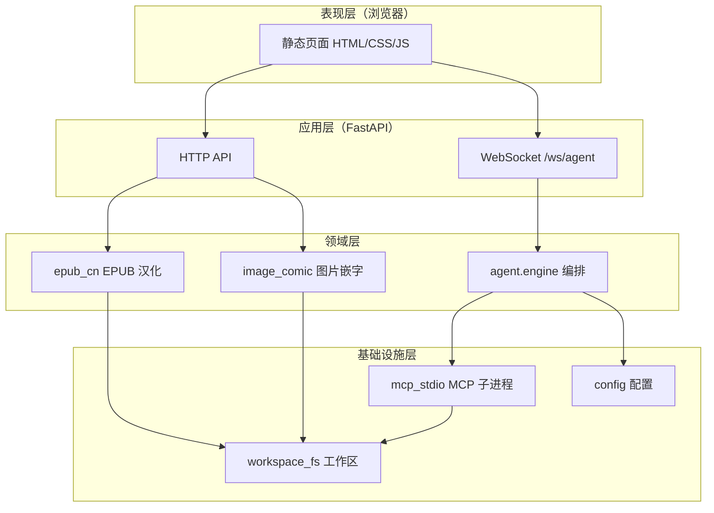
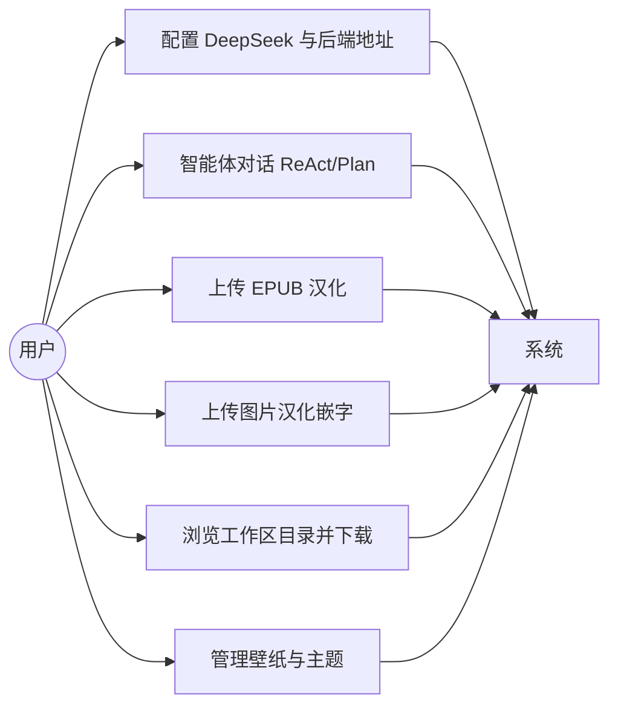
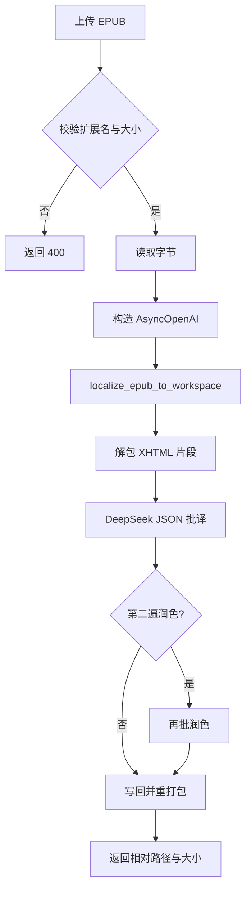
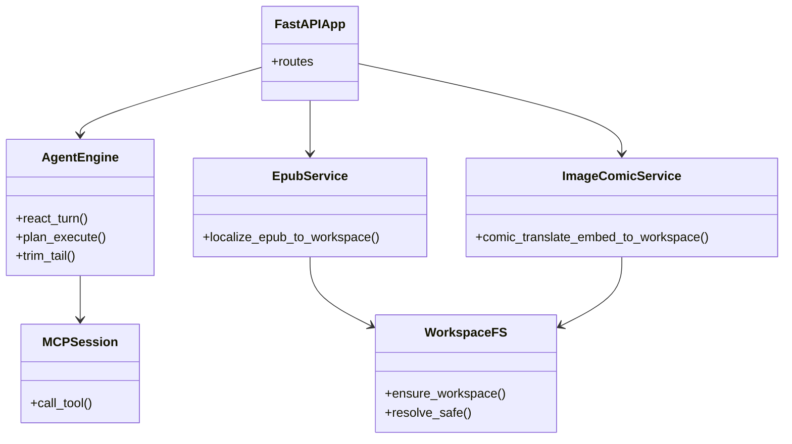
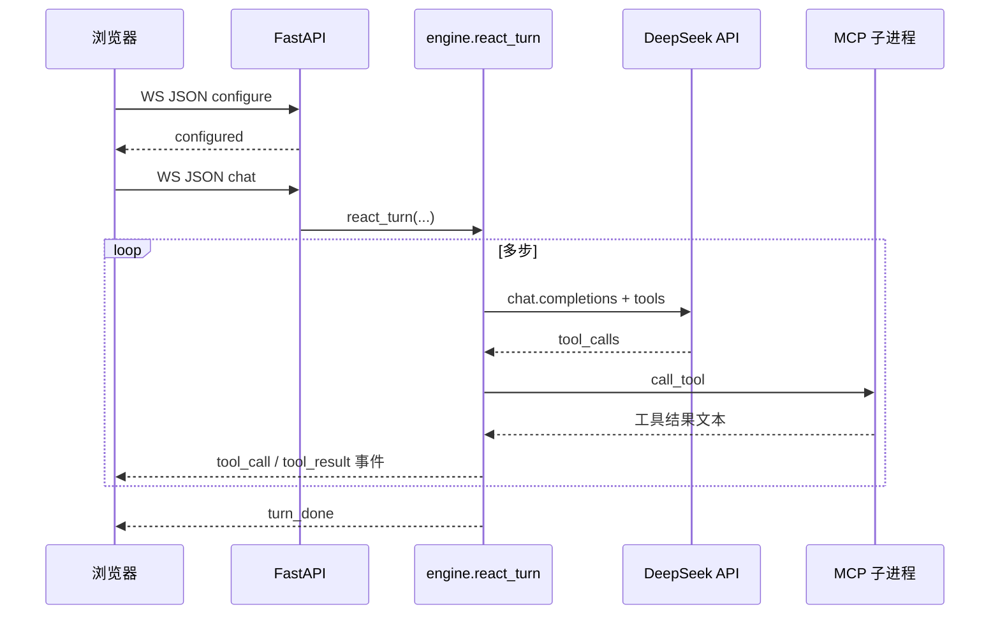

# LSJGP 系统设计说明书

**项目名称**：基于 MCP 与 DeepSeek 的智能体工作台（Agent Web）  
**团队**：LSJGP（广东工业大学计算机学院 · 软件工程）  
**文档版本**：V1.0  
**编制日期**：2026-05-10  

---

## 文档说明

本文档依据《计算机软件需求说明编制指南》《计算机软件设计说明编制指南》等工程文档惯例，采用**自顶向下、分层细化**方式描述本仓库已实现及规划中的软件设计。图形采用 **Mermaid** 编写，导出 PDF 时请使用支持 Mermaid 的渲染器（如 Typora、部分 CI 插件）。

---

## 1 引言

### 1.1 编写目的

明确系统边界、逻辑架构、关键模块与接口，支撑团队编码、测试与课程评审。

### 1.2 背景与范围

系统提供：

- 基于 **WebSocket** 的 **DeepSeek** 大模型编排（**ReAct** / **Plan-and-Execute**），通过 **MCP（Model Context Protocol）** 调用本地工作区工具（列目录、读写文件、抓取网页等）。  
- **HTTP** 批量任务：**EPUB 汉化**、**图片 OCR + 汉化 + 嵌字**。  
- **静态前端**托管于同一 FastAPI 进程（可选）。

**不在本期范围**：多租户账号体系、中心化数据库、生产级权限审计（仅工作区路径约束）。

### 1.3 定义与缩略语

| 缩写 | 含义 |
|------|------|
| **API** | Application Programming Interface |
| **MCP** | Model Context Protocol，用于 LLM 与工具宿主之间的协议 |
| **LLM** | Large Language Model，本项目中为 DeepSeek 兼容接口 |
| **WS** | WebSocket |
| **EPUB** | 电子出版物标准格式 |
| **OCR** | Optical Character Recognition |
| **ORM** | Object-Relational Mapping（规划阶段） |
| **DPSK** | 环境变量 `DPSK_API_KEY` 等代称，指 DeepSeek 密钥配置 |

---

## 2 系统总体设计

### 2.1 系统目标

为单机或内网用户提供「对话式智能体 + 文档/图片批处理」一体化入口，数据落盘于可配置的 **工作区根目录** `WORKSPACE_ROOT`。

### 2.2 运行环境

| 类别 | 说明 |
|------|------|
| 服务端 OS | Windows / Linux / macOS |
| 运行时 | Python 3.10+ |
| 依赖框架 | FastAPI、Uvicorn、OpenAI Python SDK、MCP Client、FastMCP |
| 客户端 | 现代浏览器（Chrome / Edge 等） |

### 2.3 总体结构图

---

## 3 逻辑分层设计

### 3.1 表现层

- **资源位置**：`frontend/web/`  
- **职责**：用户配置、发起 WS 会话、上传 EPUB/图片、展示日志与下载链接。  
- **约束**：敏感密钥默认存 **LocalStorage**（可改为仅环境变量），需提示用户浏览器安全策略。

### 3.2 应用层

- **资源位置**：`backend/main.py`  
- **职责**：路由注册、CORS、表单解析、`AsyncOpenAI` 客户端构造、静态文件挂载、中间件（如 API 路径尾部斜杠规范化）。  
- **主要端点**：`/api/health`、`/api/catalog`、`/api/catalog/download`、`/api/epub/localize`、`/api/image/comic_translate`、`/api/wallpaper/*`、`/ws/agent`。

### 3.3 领域层

| 模块 | 文件 | 职责 |
|------|------|------|
| Agent 引擎 | `backend/agent/engine.py` | ReAct 循环、Plan-Execute、工具调用封装、历史裁剪 |
| EPUB 汉化 | `backend/epub_cn.py` | 解包、片段批译、正则与术语表、重打包 |
| 图片嵌字 | `backend/image_comic.py` | RapidOCR、DeepSeek JSON 批译、竖/横排嵌字 |
| MCP 会话 | `backend/mcp_stdio.py` | 拉起 `mcp_server.py`、会话内工具列表与 OpenAI tools 映射 |

### 3.4 基础设施层

| 模块 | 职责 |
|------|------|
| `mcp_server.py` | FastMCP stdio 服务：`ls`、`workspace_file_io`、抓取等 |
| `backend/workspace_fs.py` | 工作区创建与路径穿越校验 |
| `backend/config.py` | 环境变量与默认模型、端口 |

---

## 4 UML 设计

### 4.1 用例图

### 4.2 活动图（EPUB 汉化）

### 4.3 类图（后端包级）

### 4.4 时序图（WebSocket 一轮 ReAct）

### 4.5 协作图（概念）

编排器 **AgentEngine** 与 **ClientSession(MCP)**、**AsyncOpenAI** 三者协作：引擎负责消息历史与工具 JSON 规范化；MCP 负责受限文件与抓取；LLM 负责决策下一步工具或自然语言回复。

---

## 5 接口设计

### 5.1 REST 摘要

| 方法 | 路径 | 说明 |
|------|------|------|
| GET | `/api/health` | 健康检查 |
| GET | `/api/catalog` | 工作区文件列表 |
| GET | `/api/catalog/download?path=` | 安全下载 |
| POST | `/api/epub/localize` | multipart EPUB + 表单密钥与选项 |
| POST | `/api/image/comic_translate` | multipart 图片 + 表单 |
| POST | `/api/wallpaper/upload` | 壁纸上传 |
| GET | `/api/wallpaper/list` | 壁纸列表 |

### 5.2 WebSocket 协议（摘要）

- 连接：`/ws/agent`  
- 消息类型：`configure`、`chat` / `message`、`clear_history`  
- 下行事件：`turn_start`、`tool_call`、`tool_result`、`assistant`、`turn_done`、`error` 等（详见实现 `engine` 与 WS 处理逻辑）。

---

## 6 安全与约束设计

- **路径**：所有下载与工作区访问经 `resolve_safe`，禁止 `..` 穿越。  
- **密钥**：支持表单或环境变量；日志中不得打印完整 Key。  
- **文件大小**：EPUB、图片、壁纸分别设上限（见代码常量）。

---

## 7 部署设计

- **启动**：`python run_server.py` → Uvicorn 加载 `backend.main:app`。  
- **配置**：`.env` 中 `WORKSPACE_ROOT`、`BACKEND_PORT`、`DPSK_*` 等。  
- **静态资源**：`FRONTEND_DIR` 存在时挂载到 `/`（API 路由优先匹配）。

---

## 8 设计追溯

| 需求要点 | 设计落点 |
|----------|----------|
| 受限工作区 | MCP `safe_path` + `resolve_safe` |
| 可替换模型 | `DEEPSEEK_DEFAULT_MODEL` 与前端表单 |
| 流式反馈 | WebSocket 事件 JSON |

---

**编制**：LSJGP  
**审定**：（占位）
